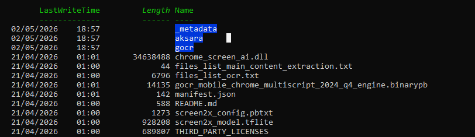
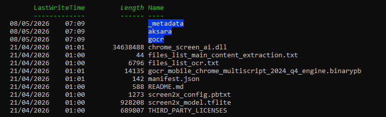
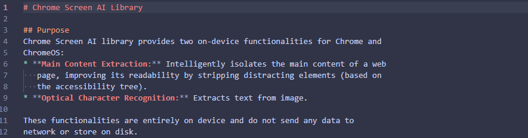

# Chrome GenAI Hardening

Toolkit de durcissement pour Google Chrome sur Windows, macOS et Linux.

Ce projet vise à réduire l'exposition aux fonctionnalités IA intégrées à Chrome en appliquant des policies Chrome Enterprise locales, en nettoyant les artefacts IA locaux connus et en documentant les comportements observés autour des composants GenAI, OptimizationGuide et Screen AI.

L'objectif est défensif : reprendre le contrôle sur les fonctionnalités IA côté navigateur, limiter les téléchargements automatiques non souhaités, documenter les composants locaux peu visibles et produire des rapports exploitables dans une démarche de privacy hardening.

## État actuel du projet

Le projet couvre désormais quatre axes principaux :

```text
1. Application de policies Chrome Enterprise anti-IA.
2. Nettoyage des modèles locaux GenAI / OptimizationGuide.
3. Nettoyage et documentation du composant local screen_ai / Screen AI / OCR.
4. Blocage expérimental de la recréation du dossier screen_ai.
```

Les scripts sont prévus pour Windows, macOS et Linux.

Le blocage de persistance documenté ici concerne principalement Windows, via une règle ACL locale appliquée au dossier `screen_ai`.

## Contexte de vérification

Tests réalisés sur une machine Windows avec Google Chrome :

```text
Version 148.0.7778.97 (Build officiel) (64 bits)
```

Chemin analysé :

```text
%LOCALAPPDATA%\Google\Chrome\User Data\
```

Un dossier local nommé `screen_ai` a été identifié. Il contient notamment :

```text
_metadata
aksara
gocr
chrome_screen_ai.dll
files_list_main_content_extraction.txt
files_list_ocr.txt
gocr_mobile_chrome_multiscript_2024_q4_engine.binarypb
manifest.json
README.md
screen2x_config.pbtxt
screen2x_model.tflite
THIRD_PARTY_LICENSES
```

Ces fichiers indiquent la présence d'un composant local lié à Chrome Screen AI, à l'OCR et à l'extraction du contenu principal.

## Observation locale concernant screen_ai

Lors d'un test local, le script de durcissement renforcé Windows a supprimé le dossier suivant :

```text
AppData\Local\Google\Chrome\User Data\screen_ai
```

Taille supprimée :

```text
106.88 Mo
```

Extrait du rapport :

```text
Supprimé : C:\Users\██████████\AppData\Local\Google\Chrome\User Data\screen_ai (106.88 Mo)
```

Après suppression manuelle ou via script, Chrome a été observé recréant le dossier `screen_ai` au prochain lancement du navigateur, avec un identifiant ou numéro de version différent.

Cette observation suggère que `screen_ai` peut être géré comme un composant local récupérable ou réinstallable automatiquement par Chrome, probablement via son mécanisme interne de composants ou de mise à jour.

La suppression seule ne suffit donc pas forcément à empêcher son retour.

## Fenêtre temporelle suspectée

D'après les éléments observés localement, la persistance ou l'installation de `screen_ai` semble avoir eu lieu dans une fenêtre comprise entre les mises à jour Chrome du :

```text
2 avril 2026
20 avril 2026
```

Cette période reste une hypothèse de travail basée sur les timestamps et les éléments visibles sur la machine analysée.

Un point particulièrement déroutant est que l'heure indiquée dans les éléments de persistance de `screen_ai` correspondrait à un moment où la machine était éteinte et donc hors connexion, selon l'observation locale.

Ce point ne permet pas, à lui seul, de conclure définitivement au moment exact de l'installation. Certains timestamps peuvent être hérités d'une archive, d'un manifeste, d'un composant téléchargé, d'une extraction différée, d'une mise à jour ou d'un mécanisme interne de Chrome.

Cependant, l'observation reste importante à documenter, car elle renforce le problème principal du projet : un composant local sensible, capable d'OCR et d'extraction de contenu, peut apparaître dans le profil Chrome sans consentement utilisateurice clair, explicite et compréhensible dans l'interface classique du navigateur.

Cette situation est interprétée ici comme une atteinte au contrôle utilisateurice et comme un problème de transparence autour du consentement, surtout lorsque le composant est recréé après suppression.

## Persistance de screen_ai

L'analyse du code `ScreenAIInstallState` montre que Screen AI dispose d'une logique d'installation dédiée côté navigateur.

Le comportement observé est cohérent avec cette logique :

```text
- un client interne peut indiquer que Screen AI est nécessaire.
- Chrome met à jour une date de dernière utilisation.
- Chrome peut déclencher DownloadComponent().
- si les fonctionnalités OCR ou Main Content Extraction sont actives, Chrome peut tenter de récupérer le composant.
- une nouvelle version peut être téléchargée alors qu'une ancienne existe déjà.
- la nouvelle version peut être utilisée après redémarrage du navigateur.
```

Le point sensible n'est donc pas seulement la capacité OCR de Screen AI, mais sa gestion comme composant récupérable par Chrome.

Sans interface claire permettant à l'utilisateurice de comprendre, refuser ou désactiver durablement ce comportement, cela pose un problème de transparence et de contrôle.

## Blocage actuel de la persistance

À l'heure actuelle, la persistance de `screen_ai` a été coupée localement via une règle simple dans un script PowerShell :

```powershell
if ($BlockRecreation) {
    Bloquer-RecreationScreenAI -Actions $Actions
}
```

Cette option est activée avec :

```powershell
-BlockRecreation
```

Principe du blocage :

```text
1. supprimer le dossier screen_ai existant.
2. recréer un dossier screen_ai vide.
3. modifier les ACL Windows du dossier.
4. retirer l'écriture au compte utilisateurice courant.
5. conserver des droits administrateurice/SYSTEM.
```

L'objectif est d'empêcher Chrome, lancé dans le contexte utilisateurice, de réécrire ou recréer librement le contenu du dossier `screen_ai`.

Exemple d'exécution :

```powershell
Set-ExecutionPolicy -Scope Process Bypass -Force
.\Disable-Chrome-ScreenAI-Hardening.ps1 -ForceCloseChrome -BlockRecreation
```

Pour retirer ce blocage :

```powershell
.\Disable-Chrome-ScreenAI-Hardening.ps1 -UnblockRecreation
```

Important : ce blocage est expérimental. Il ne doit pas être présenté comme une garantie absolue. Il coupe la persistance observée en bloquant l'écriture sur le chemin connu, mais Chrome ou Google peuvent modifier les chemins, les mécanismes de téléchargement ou le comportement du composant dans de futures versions (Pour le moment je met pas à disposition le script).

Par prudence, le code de blocage ACL peut être conservé comme outil personnel de recherche et ne pas être publié directement, le but est d'éviter une mauvaise utilisation ou des effets de bord chez d'autres utilisateurices.

## Captures de validation

### Contenu du dossier screen_ai

```md


```


### README local Chrome Screen AI

Le fichier README présent dans le composant indique que Chrome Screen AI fournit deux fonctionnalités locales pour Chrome et ChromeOS :




```text
Main Content Extraction
Optical Character Recognition
```

Il indique également que ces fonctionnalités sont exécutées entièrement sur l'appareil.

## Disclaimer concernant screen_ai

Le dossier `screen_ai` n'a pas été découvert initialement via l'article ayant motivé ce projet. Il a été identifié ensuite, lors d'une analyse plus poussée du profil utilisateur Chrome.

Ce composant ne semble pas être exactement le même élément que le modèle Gemini Nano / GenAI évoqué dans l'article de départ. Il semble plutôt lié à Chrome Screen AI, à l'OCR et à l'extraction du contenu principal.

Tout le monde n'aura pas forcément ce dossier. Sa présence peut dépendre de la version de Chrome, du canal utilisé, des fonctionnalités activées, des flags expérimentaux, des tests progressifs côté Google, du profil utilisateurice et de l'historique d'utilisation.

Canaux Chrome susceptibles de différer :

```text
Stable
Extended Stable
Beta
Dev
Canary
```

Ce projet ne prétend pas démontrer que Chrome analyse l'écran de l'utilisateurice en permanence. Il documente un composant local capable d'OCR et d'extraction de contenu, peu visible dans l'interface classique du navigateur, et potentiellement recréé automatiquement après suppression.

Le problème principal est donc :

```text
transparence faible + consentement flou + contrôle utilisateurice limité + persistance
```

## Analyse du code source Chromium

Le code source Chromium lié à Screen AI se trouve dans :

```text
services/screen_ai/
chrome/browser/screen_ai/
```

Liens :

```text
https://source.chromium.org/chromium/chromium/src/+/main:services/screen_ai/
https://source.chromium.org/chromium/chromium/src/+/main:chrome/browser/screen_ai/
```

Éléments analysés :

```text
ScreenAILibraryWrapper
ScreenAILibraryWrapperImpl
ScreenAILibraryWrapperFake
ScreenAIService
ScreenAIInstallState
screen_ai_service_impl
screen_ai_ocr_perf_test
BUILD.gn
include_rules
OWNERS / chromium-accessibility
```

L'analyse montre que Chromium dispose d'une architecture permettant de :

```text
- charger une bibliothèque locale Screen AI depuis le disque.
- fournir à cette bibliothèque des fichiers de modèles.
- initialiser un pipeline OCR.
- exécuter OCR sur des images.
- extraire le contenu principal d'une page.
- manipuler des arbres d'accessibilité.
- utiliser des annotations visuelles via protobuf.
- enregistrer des métriques d'usage et de performance.
- utiliser une sandbox sur certains systèmes.
- fonctionner avec une vraie implémentation ou une version fake de test.
- gérer l'installation ou la récupération du composant Screen AI.
```

## Ce que l'analyse confirme

L'analyse confirme que `screen_ai` n'est pas un simple dossier passif.

Le composant est lié à une architecture Chromium capable de :

```text
- charger une bibliothèque native locale.
- utiliser des fichiers de modèle et de configuration.
- traiter des images via OCR.
- retourner des annotations visuelles.
- analyser un arbre d'accessibilité.
- identifier le contenu principal d'une page.
- servir plusieurs clients internes.
- être récupéré ou réinstallé selon l'état interne de Chrome (via leurs propres décisions).
```

Clients internes mentionnés dans le code :

```text
PDF Viewer
Local Search
Camera App
Media App
Screenshot Text Detection
Tests
```

## Ce que l'analyse ne prouve pas

Les éléments analysés ne prouvent pas que Chrome analyse l'écran de l'utilisateurice en permanence.

Ils confirment plutôt que Chromium dispose d'un service local capable d'utiliser Screen AI à la demande, lorsque certaines fonctionnalités internes le déclenchent (Sans le consentement utilisateurice).

## Modes de durcissement

### Mode ciblé

Scripts concernés :

```text
scripts/windows/Disable-Chrome-GenAI.ps1
scripts/macos/Disable-Chrome-GenAI-macOS.sh
scripts/linux/Disable-Chrome-GenAI-linux.sh
```

Policy principale :

```text
GenAILocalFoundationalModelSettings = 1
```

### Mode renforcé

Scripts concernés :

```text
scripts/windows/Disable-Chrome-AI-Features.ps1
scripts/macos/Disable-Chrome-AI-Features-macOS.sh
scripts/linux/Disable-Chrome-AI-Features-linux.sh
```

Policies appliquées :

```text
AIModeSettings                       = 1
CreateThemesSettings                 = 2
DevToolsGenAiSettings                = 2
GeminiActOnWebSettings               = 1
GeminiSettings                       = 1
GenAILocalFoundationalModelSettings  = 1
HelpMeWriteSettings                  = 2
HistorySearchSettings                = 2
SearchContentSharingSettings         = 1
```

La règle suivante n'est pas utilisée volontairement :

```text
GenAiDefaultSettings
```

### Mode Screen AI Hardening

Script concerné :

```text
scripts/windows/Disable-Chrome-ScreenAI-Hardening.ps1
```

Options importantes :

```text
-ForceCloseChrome
-BlockRecreation
-UnblockRecreation
-WhatIf
```

## Script Screen AI Hardening

Le script `Disable-Chrome-ScreenAI-Hardening.ps1` agit sur plusieurs leviers :

```text
- application des policies IA connues.
- sauvegarde des policies Chrome existantes.
- fermeture optionnelle de Chrome.
- nettoyage du dossier screen_ai.
- nettoyage de la préférence locale accessibility.screen_ai.last_used_time.
- blocage optionnel de la recréation via ACL Windows.
```

La logique de blocage de persistance repose sur ce bloc :

```powershell
if ($BlockRecreation) {
    Bloquer-RecreationScreenAI -Actions $Actions
}
```

Le blocage est appliqué uniquement si l'option `-BlockRecreation` est utilisée.

## Utilisation

### Windows

PowerShell en administrateurice :

```powershell
Set-ExecutionPolicy -Scope Process Bypass -Force
.\scripts\windows\Disable-Chrome-AI-Features.ps1
```

Durcissement Screen AI avec blocage de recréation :

```powershell
.\scripts\windows\Disable-Chrome-ScreenAI-Hardening.ps1 -ForceCloseChrome -BlockRecreation
```

Retirer le blocage :

```powershell
.\scripts\windows\Disable-Chrome-ScreenAI-Hardening.ps1 -UnblockRecreation
```

### macOS

```bash
chmod +x scripts/macos/Disable-Chrome-AI-Features-macOS.sh
sudo ./scripts/macos/Disable-Chrome-AI-Features-macOS.sh
osascript -e 'quit app "Google Chrome"'
```

### Linux

```bash
chmod +x scripts/linux/Disable-Chrome-AI-Features-linux.sh
sudo ./scripts/linux/Disable-Chrome-AI-Features-linux.sh
```

## Vérification

### chrome://policy

Ouvre :

```text
chrome://policy/
```

Clique sur `Reload policies`.

Résultat attendu :

```text
AIModeSettings                       1    OK
CreateThemesSettings                 2    OK
DevToolsGenAiSettings                2    OK
GeminiActOnWebSettings               1    OK
GeminiSettings                       1    OK
GenAILocalFoundationalModelSettings  1    OK
HelpMeWriteSettings                  2    OK
HistorySearchSettings                2    OK
SearchContentSharingSettings         1    OK
```

### screen_ai

Chemin Windows principal :

```text
%LOCALAPPDATA%\Google\Chrome\User Data\screen_ai
```

## Analyse avec Procmon

Filtres recommandés :

```text
Process Name is chrome.exe
Path contains screen_ai
Operation is CreateFile
Operation is WriteFile
Operation is SetBasicInformationFile
Operation is CreateFileMapping
```

Objectif :

```text
- identifier le processus qui recrée le dossier.
- identifier le moment exact de recréation.
- identifier les fichiers écrits.
- vérifier si la recréation intervient au lancement du navigateur.
- chercher une méthode propre pour empêcher sa réinstallation.
```

## Limites

Ce projet réduit fortement les fonctionnalités IA intégrées à Chrome côté navigateur, mais il ne peut pas garantir le blocage total de tous les contenus IA côté serveur.

Limites connues :

```text
- une page web peut afficher du contenu généré par IA.
- un moteur de recherche peut afficher des résultats IA côté serveur.
- une extension peut utiliser ses propres fonctionnalités IA.
- Google peut modifier ou ajouter des policies dans de futures versions.
- certaines policies peuvent dépendre de la version de Chrome installée.
- screen_ai peut être recréé ou retéléchargé si Chrome le juge nécessaire.
- le blocage ACL est expérimental et dépend du chemin actuellement observé.
- les timestamps observés ne suffisent pas toujours à prouver l'heure exacte de téléchargement ou d'extraction.
```

## Sources

```text
https://www.thatprivacyguy.com/blog/chrome-silent-nano-install/
https://chromeenterprise.google/policies/
https://developer.chrome.com/docs/ai/
https://source.chromium.org/chromium/chromium/src/+/main:services/screen_ai/
https://source.chromium.org/chromium/chromium/src/+/main:chrome/browser/screen_ai/
```

## Licence

Projet sous licence MIT.

## Auteurice

Projet créé par Potate_bulle dans une démarche de privacy hardening et d'administration Windows, macOS et Linux défensive.

## Résumé rapide

```text
But      : désactiver les fonctionnalités IA intégrées à Chrome
Systèmes : Windows, macOS, Linux
Langages : PowerShell, Bash
Niveau   : Privacy Hardening
Action   : policies locales + suppression des modèles locaux + screen_ai + blocage ACL optionnel
Constat  : screen_ai peut être recréé automatiquement après suppression
Fenêtre  : persistance suspectée entre les mises à jour du 2 avril 2026 et du 20 avril 2026
État     : persistance de screen_ia coupée le 08 Mai 2026 via -BlockRecreation
```
